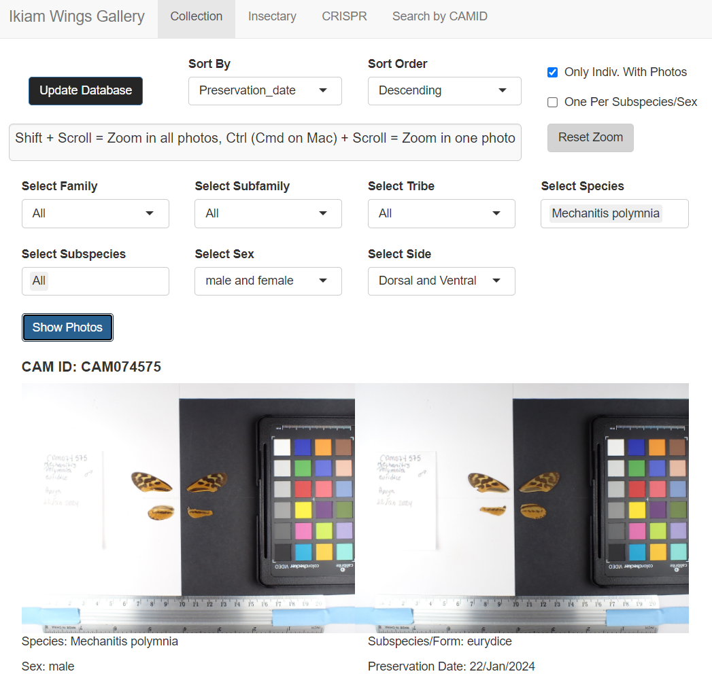

# Shiny Ikiam Wings Gallery

Shiny application to view butterfly wing photos of specimens from the ongoing project at Ikiam - Ecuador.

## Deployment

This application was previously hosted on [Google Cloud Run](https://console.cloud.google.com/run) using the prebuilt [rocker/shiny-verse](https://rocker-project.org/images/versioned/shiny.html) Docker container. It has been migrated to [Amazon Elastic Compute Cloud (EC2)](https://aws.amazon.com/ec2/) using Docker. The custom domain is managed through [FreeDNS](https://freedns.afraid.org).

[Live application](http://wings.gallery.info.gf)

For detailed deployment instructions, see [DEPLOYMENT.md](DEPLOYMENT.md).

A red border indicates server disconnection. Current images remain visible but require refresh to restore interactivity.

## Interface

## How it works

It downloads from Google Sheets the database and store a local backup. It transforms google drive photo links from the database into thumbnail links for display. The local database can be updated directly from the Shiny interface.

## Features

- **Database Update**: Provides a button on the Shiny interface to update the local database. 
- **Collection Tab**: Filter individuals based on Family, Subfamily, Tribe, Species, Subspecies/Form, and Sex. Options to sort results and display dorsal, ventral, or both sides of the specimens.
- **Insectary Tab**: View photos of specimens from the insectary. Filter by Species, Subspecies/Form, Sex, and Insectary ID.
- **CRISPR Tab**: View photos of CRISPR-injected individuals. Filter by Species, Sex, and whether they are mutants.
- **Search by CAMID**: Search for specific individuals by entering one or more CAMIDs.
- **Sorting by**: Sort results by CAM_ID, Preservation Date, or Row Number in ascending (A to Z, older to recent) or descending (Z to A, recent to older) order.
- **Display Options**:
  - **Only Indiv. With Photos**: Display only specimens with available photos.
  - **One Per Subspecies/Sex**: Show only one individual per subspecies per sex.
  - **Select Side**: Choose to display dorsal, ventral, or both sides.
- **Zoom Functionality**:
  - **Zoom Controls**: Use Shift + Scroll to zoom all photos, Ctrl + Scroll to zoom individual photos, Click & Drag to move one photo, Shift + Arrow Keys to move all photos.
  - **Reset Zoom**: A button to reset zoom level and position for all images.

## Usage

To use this Shiny application in RStudio:

1. **Clone the Repository**:
   - Click on **New Project**.
   - Choose **Version Control**.
   - Select **Git** and enter the repository URL: `https://github.com/rapidspeciation/Shiny_Ikiam_Wings_Gallery`

2. **Install Required Packages**:
   - Open `Ikiam_Wings_Gallery_app.R`.
   - If prompted, click **Install** to install any required packages.

3. **Run the Application**:
   - Click the green **Run App** button at the top of the source code editor to launch the application.

4. **Update the Project**:
   - To fetch the latest changes, go to the Git tab and click the blue down arrow (Pull).