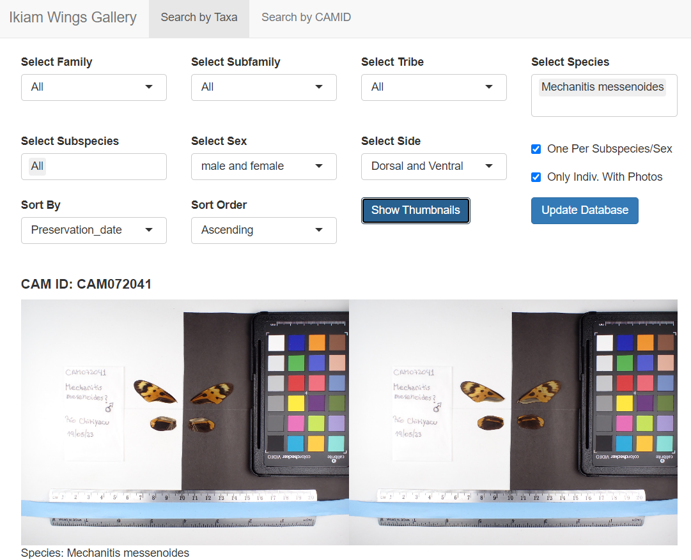

# Shiny Ikiam Wings Gallery

Shiny application to view butterfly wing photos of specimens from the ongoing project at Ikiam - Ecuador.

## Interface

Screenshot of the Shiny Ikiam Wings Gallery's user interface:

## How it works

It downloads from Google Sheets the database and store a local backup since downloading takes a few seconds. It transforms google drive photo links from the database into thumbnail links that can be loaded on the Shiny interface.

## Features

- **Database Update**: Provides a button on the Shiny interface to update the local database. 
- **Search by Taxa**: This tab allows users to filter individuals based on their taxa.
- **Search by CAMID**: The user can input one or more CAMIDs to search for specific individuals.
- **Sorting by**: The user can choose wether to sort by CAMID or preservation date wether ascending (A to Z, older to recent) or descending (Z to A, recent to older).
- **One Per species/sex**: A checkbox, if checked will show only one individual per subspecies per sex, resembling identification guides such as Sangay or Butterflies of America.
- **Only Indiv. With Photos**: When selected, the application will display only those specimens for which wing photos have been taken and uploaded to Google Drive.
- **Choose View**: Whether to show pictures of dorsal, ventral or both sides.
- **Zoom in Photos**: When checked, two sliders will appear (image height, image scale) to control size and zoom of photos. Defaults to 2x zoom.

## Usage

To use this Shiny application in your RStudio:

1. Click on **New Project**.
2. Choose **Version Control**.
3. Select **Git** to clone the project from this Git repository.
4. In the repository URL, paste the following link: https://github.com/rapidspeciation/Shiny_Ikiam_Wings_Gallery.
5. Navigate to the **Files** panel in the lower right of RStudio, and open `Ikiam_Wings_Gallery_app.R`. If required packages are not installed, a prompt will appear at the top of the source code. Click **Install** to proceed. Once installation is complete, launch the application by clicking the green **Run App** button at the top of the source code editor.
